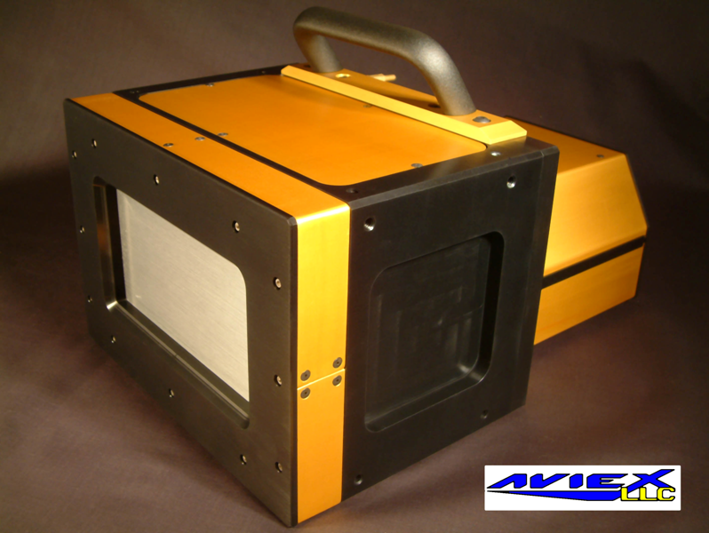
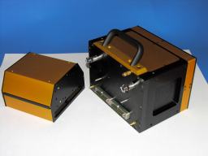
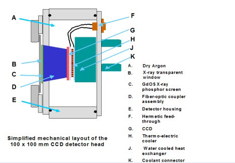
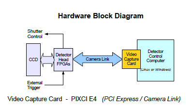

.. _camera-aviex:

Aviex camera plugin
-------------------





Intoduction
```````````
The PCCD-170170 is a large area detector (4096 x 4096) designed for use in WAXS or SAXS experiments in a vacuum environment.





The detector supports full frame, multiframe time-sliced, and streak camera modes of operation.

Used at the SWING beamline of Synchrotron SOLEIL to make timeresolved SAXS measurements together with another WAXS detector.

This Lima plugin controls an Aviex camera under linux.

It is based on the MX beamline control toolkit which can be found at http://mx.iit.edu

It has been tested at the Synchrotron SOLEIL facility, but is not already installed on a Beamline.

Module configuration
````````````````````
Previously to this you have to compile/install the Mx Library/Driver to the default path (/opt/mx/).

Starting the Mx driver doing this :

.. code-block:: cpp

	cd /opt/mx/sbin/
	./mx start

The minimum configuration file is *config.inc* :

.. code-block:: sh

  COMPILE_CORE=1
  COMPILE_SIMULATOR=0
  COMPILE_SPS_IMAGE=1
  COMPILE_ESPIA=0
  COMPILE_FRELON=0
  COMPILE_MAXIPIX=0
  COMPILE_PILATUS=0
  COMPILE_BASLER=0
  COMPILE_AVIEX=1
  COMPILE_CBF_SAVING=0
  export COMPILE_CORE COMPILE_SPS_IMAGE COMPILE_SIMULATOR \
         COMPILE_ESPIA COMPILE_FRELON COMPILE_MAXIPIX COMPILE_AVIEX COMPILE_PILATUS \
         COMPILE_BASLER COMPILE_CBF_SAVING


See :ref:`Compilation`


Initialisation and Capabilities
````````````````````````````````
In order to help people to understand how the camera plugin has been implemented in LImA this section
provide some important information about the developer's choices.

Camera initialisation
......................

There are 2 parameter to be filled by your Lima client:

	- The detector friendly name , can be any string defined by user.
	- The detector database file name : this file must contains configuration parameters as IP adress, port.

Std capabilites
................

This plugin has been implemented in respect of the mandatory capabilites but with some limitations according 
to some programmer's  choices.  We only provide here extra information for a better understanding
of the capabilities for the Aviex camera.

* HwDetInfo
  
 - Max image size is : 4096 * 4096
 - 16 bit unsigned type is supported

* HwSync

  trigger type supported are:
	- IntTrig
	- ExtTrigSingle
  
Optional capabilites
........................

* HwBin
	- 1 * 1
	- 2 * 2
	- 4 * 4
	- 8 * 8
	- ...

Binning above are typical values, but binning is not necessarily square.

* HwRoi
	Not yet implemented 

Configuration
`````````````

No Specific hardware configuration are needed

How to use
````````````
here is the list of accessible fonctions to configure and use the Aviex detector:

.. code-block:: cpp

	//-- Related to Aviex specific features
	void getExpMultiplier(double& exp_mult);
	void setExpMultiplier(double exp_mult);
	void getLatencyTime(double& period_time);
	void setLatencyTime(double  period_time);
	void getGapMultiplier(double& gap_mult);
	void setGapMultiplier(double  gap_mult);
	void getMxLibraryVersion(std::string& version);
	void getInternalAcqMode(std::string& acq_mode);	
	//! Available mode : ONESHOT, MULTIFRAME, GEOMETRICAL, MEASURE_DARK, MEASURE_FLOOD_FIELD
	void setInternalAcqMode(const std::string& mode);
	void getReadoutDelayTime(double& readout_delay);
	void setReadoutDelayTime(double readout_delay);
	void getReadoutSpeed(bool& readout_speed);
	void setReadoutSpeed(bool readout_speed);
	void getInitialDelayTime(double& initial_delay);
	void setInitialDelayTime(double initial_delay);
	//! MASK_CORRECTION_BIT_POSITION		= 0
	//! BIAS_CORRECTION_BIT_POSITION		= 1
	//! DARK_CORRECTION_BIT_POSITION		= 2
	//! FLOOD_CORRECTION_BIT_POSITION		= 3
	//! GEOM_CORRECTION_BIT_POSITION		= 12
	void setCorrectionFlags(unsigned long);


